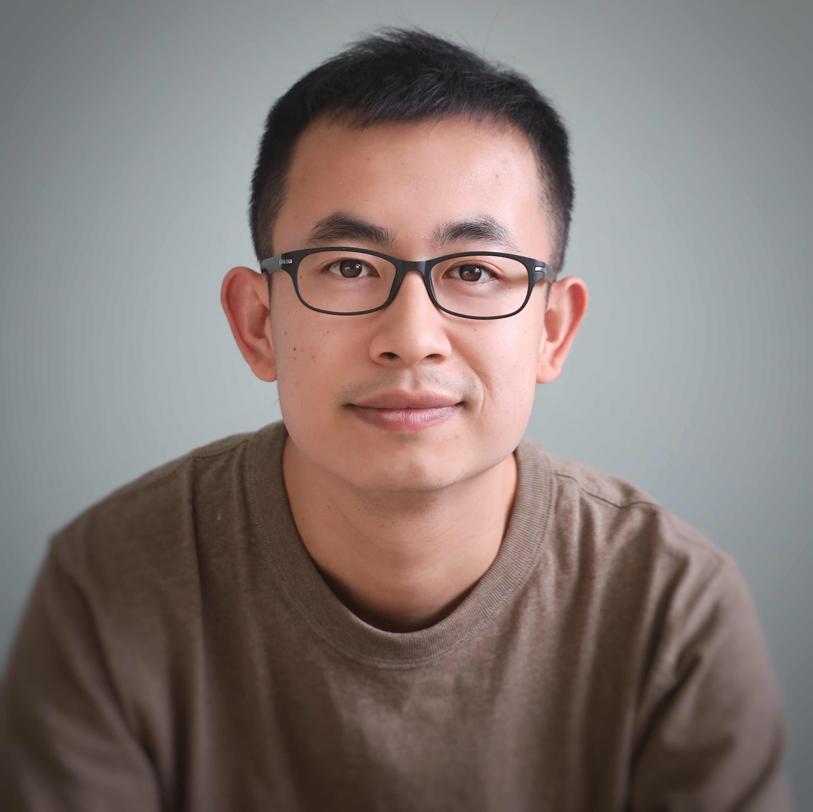

---
# Feel free to add content and custom Front Matter to this file.
# To modify the layout, see https://jekyllrb.com/docs/themes/#overriding-theme-defaults

layout: home
---

## About Me

I am a computational scientist at the Broad Institute, developing tools and pipelines for spatial omics data processing, benchmarking, analysis and interactive visualizations. With a Ph.D. in Agronomy from Kansas State University, my career has been defined by a passion for translating complex imaging and sensor data into actionable digital solutions. Whether using optical sensors to assess crop/soil conditions or spatial transcriptomics to diagnose diseases, my goal remains the same: leveraging data science to increase the sustainability of agricultural systems and improve human health outcomes.

## Research Interests

- Highly multiplexed imaging
- Spatial Omics
- Interactive visualization and analysis
- AI applications in biology
- Precision Medication
- Tumor biology
- Remote sensing application in Precision Agriculture

## Data Analysis

- Spatial transcriptomics/proteomics
- Single-cell analysis
- Geospatial analysis
- Computer Vision & Image analysis
- Time series

## Tools and skills

- AI & DL Models: CNNs, Cellpose, Baysor, SAM, U-Net, StarDist, Autoencoders, Graph Neural Networks (GNNs).
- Computer Vision & Image Processing: High-Multiplexed Image Processing (CODEX, CyCIF, MERFISH, Xenium, CosMx), Cell Segmentation, Feature Extraction, CellProfiler, Image Registration, QC & Normalization, OpenCV, Scikit-Image, DeepCell, Mesmer, Unmicst, Watershed segmentation
- DL Frameworks & Libraries: PyTorch, TensorFlow, Scikit-Learn, PyTorch Geometric, SpatialData, AnnData.
- MLOps & Infrastructure: GCP, AWS, GIT, Docker, WDL, Nextflow, HPC, CUDA

## Work History

**Computational Biologist** (2021 May - 2026 June)\\
[Spatial Technology Platform](https://www.broadinstitute.org/spatial-technology-platform), [Broad Institute of MIT and Harvard](https://www.broadinstitute.org/), Cambridge, MA.
- Developed [Celldega](https://github.com/broadinstitute/celldega) ([preprint](https://www.biorxiv.org/content/10.64898/2026.08.13.744672v1)), an integrated toolkit for analysis and visualization of spatial and single-cell data.
- Conducted the [systematic benchmarking of imaging spatial transcriptomics platforms in FFPE human samples across healthy and cancerous tissues](https://www.nature.com/articles/s41467-025-64990-y).
- Co-developed and scaled deep learning-based cell segmentation pipelines using Cellpose (CNNs) and WDL on GCP, processing tens of millions of cells across large-scale spatial transcriptomics datasets with GPU acceleration.
- Performed end-to-end computational consulting for a private company, including data processing, cell type annotation, enrichment analysis, spatial enrichment of certain cell types based on distance, and report generation and presentation.
- Integrated single-cell spatial transcriptomics and proteomics to resolve T cell functional states in human renal cell carcinoma.
- [Compared imaging-based spatial proteomics platforms (CODEX, CycIF, mIF) across tissues](https://docs.google.com/presentation/d/1SsD6DezD7aeCQ17bcThbsFEfNSL8cqRd6e9jP0dVmkU/edit?usp=sharing)
- Engineered automated digital pathology preprocessing pipelines for multi-channel tissue imagery, performing signal-to-noise ratio (SNR) optimization, background subtraction/autofluorescence removal, and artifact mitigation to ensure high-fidelity downstream analysis.
- Collaborated directly with pathologists including Scott Rodig, MD, PhD to validate and refine high-multiplexed immunofluorescence image analysis workflows, establishing expert-annotated ground truth for cell type classification and disease-relevant cellular functional states.
- Designed pipelines to process and analyze highly multiplexed imaging data on Google Cloud Platform.
- Evaluated state-of-the-art Vision Foundation Models (e.g., Segment Anything Model / SAM) and deep learning architectures for fine-grained cell and tissue segmentation in multiplexed imaging.
- Engineered scalable computer vision workflows for multi-channel feature extraction, cellular phenotyping across different modalities (CODEX/CyCIF/mIF/MERFISH/Xenium/CosMX).

**Data Scientist** (2018 March - 2021 Jan)\\
Geoinnovation, [Indigo Agriculture](https://www.indigoag.com), Charlestown, MA.
- Designed on-farm experiments to test the effect of beneficial microbes coated on the seeds on the grain yield of Corn, Soy, Cotton, and Rice.
- Built predictive machine learning models (Random Forests, Gradient Boosting) and statistical pipelines to analyze multi-spectral remote sensing data for automated crop health diagnostics and yield optimization.
- Designed and implemented a pipeline for imagery data management (transfer, storage, logging, and quality control).
- Developed protocols for UAV imagery data collection implemented in 10 states in the US and South America.
- Designed and trained deep learning computer vision models (RCNN-based object detection) on high-resolution UAV RGB imagery for automated plant detection and stand counting, significantly accelerating field scouting capabilities.
- Built UAV imagery-based crop condition reports as an alert and scouting tool for farmers to do in-season crop management.
- Built modules within the “machine data factory” to clean all types of machine data automatically, including as-planted, as-applied, and as-harvested data.

**Digital Agronomist (Intern)** (2017 March - 2017 Aug)\\
[The Climate Corporation](https://climate.com/), St Louis, MO.
- Characterized soil properties using high-definition bare soil aerial imagery including color infrared and thermal data.
- Evaluated the relationship between imagery-based soil features and in-season crop response on corn and soybean.
- Developed new indices for quantifying the sub-field temperature variation and a new method for creating management zones using bare soil imagery.
